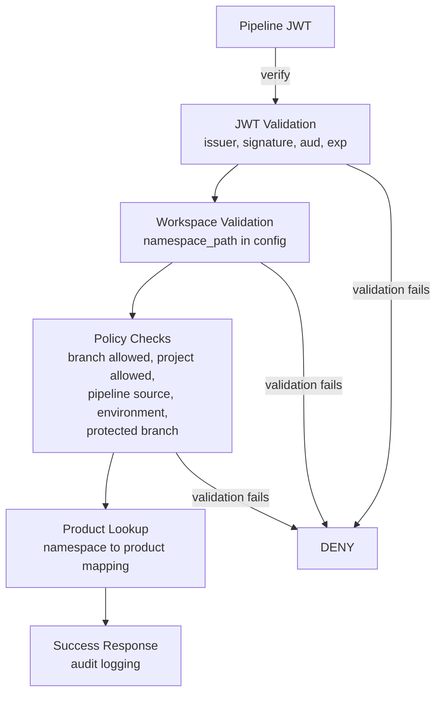

# Pipeline Flow Diagram

```mermaid
graph TD
    A[Pipeline JWT] -->|verify| B[JWT Validation<br/>issuer, signature, aud, exp]
    B --> C[Workspace Validation<br/>namespace_path in config]
    C --> D[Policy Checks<br/>branch allowed, project allowed,<br/>pipeline source, environment,<br/>protected branch]
    D --> E[Product Lookup<br/>namespace to product mapping]
    E --> F[Success Response<br/>audit logging]

    B -->|validation fails| G[DENY]
    C -->|validation fails| G
    D -->|validation fails| G
```