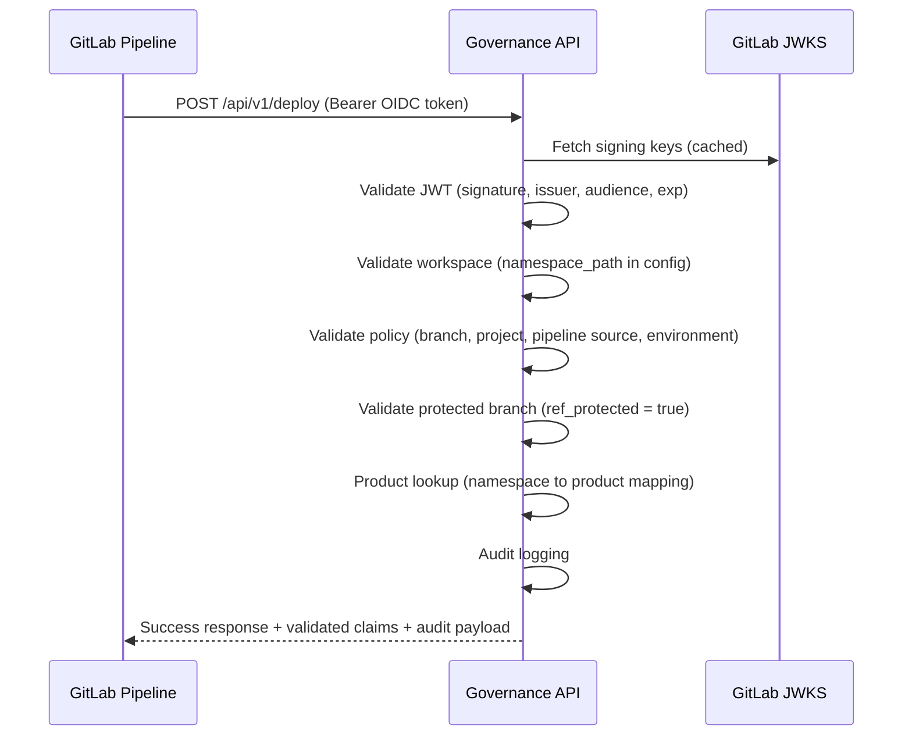

# Pipeline as Agent

## Executive Summary
- **Risk Ownership**: Every automated action is ultimately owned by the **Product Owner** (PO), the accountable human for the product.
- **Delegation**: The PO delegates authority to a specific **GitLab workspace** through an approved attestation that defines scope.
- **Execution Boundary**: The attested workspace is the **smallest trustworthy unit** that binds human accountability to machine execution.
- **Authorization & Enforcement**: A **Governance Platform Admin** approves, enforces, and can revoke attestations to keep automation within policy limits.
- **Traceability**: Each automated action is linked to the attestation, workspace, and policy version that authorized it, producing a **verifiable audit trail**.

## 1. Core Concept
A pipeline acts as a bounded software agent that executes on behalf of a Product Owner. Through attestation the PO authorizes a workspace to operate inside defined limits. Once that attestation is approved:
- The **pipeline can run autonomously**, and its actions are **attributed to the Product Owner** rather than an individual operator.
- **Accountability** stays with the human owner, while automated **execution** happens inside the attested boundary.
- The API focuses on verifying **identity, attestation, and policy scope**. It does not inspect the implementation details of the pipeline jobs themselves.

This separation keeps **risk ownership human-centered** and **execution authority machine-centered** while preserving trust between the two.

## 2. Trust Boundaries
| Trust Source | What it Proves | Accountable Party |
| --- | --- | --- |
| Pipeline JWT (OIDC) | The job originates from a verified execution boundary (workspace/branch). | Platform team |
| Product Owner Attestation | The workspace is authorized to act for a specific product and scope. | Product Owner |
| Policy Mapping (`allowed-workspaces.yml`) | The permitted products, branches, and environments for each workspace. | Governance system |

Only the composite chain—JWT + attestation + policy mapping—is accepted as proof of delegated authority.

## 3. Persona Matrix
| Persona | Primary Role | Needs | Outcome |
| --- | --- | --- | --- |
| Product Owner (PO) | Accountable human for product risk and delegation. | Attest once, renew or revoke as context changes, and review activity attributed to their delegation. | Maintains clear risk ownership and accountability. |
| Governance Platform Admin | Control authority for attestations and enforcement. | Review and approve attestation requests, enforce boundaries, and revoke when necessary. | Ensures automation runs only within attested, policy-aligned limits. |
| Developer | Operates pipelines under an attested boundary. | Use trusted automation tokens, understand denials, and stay within the approved scope. | Delivers safely and autonomously while honoring governance controls. |
| Governance/Compliance SME | Designs and oversees the control framework. | Define attestation requirements, detect gaps, and generate compliance evidence. | Preserves control integrity and continuous policy alignment. |
| Auditor/Risk Function | Independently verifies accountability and traceability. | Reconstruct authorization events, verify attestation validity, and confirm provenance. | Demonstrates compliance with verifiable proof of ownership and authorization. |

## 4. Policy Configuration
**Allowed products, workspaces, projects, branches, and environments are stored centrally**. For local development the configuration lives in `src/main/resources/allowed-workspaces.yml`.

```yaml
allowed:
  workspaces:
    - namespace: myorg/platform
      project: myorg/platform/core-api
      product: core-api
      branches:
        - main
        - production
      environments:
        - production
        - staging
```

The configuration defines where automation is permitted to operate and maps each workspace to the products covered by its attestation. Branches or environments can be omitted to allow any value.

## 5. Authorization Flow


The API stops any request that fails validation during JWT authentication. Successful requests return the validated claims and an audit payload.

## 6. Example GitLab Pipeline Call
```yaml
deploy:
  stage: deploy
  image: curlimages/curl:latest
  environment: production
  id_tokens:
    GITLAB_OIDC_TOKEN:
      aud: https://api.butterflycluster.com
  rules:
    - if: $CI_COMMIT_BRANCH == "main"
  script:
    - |
      curl -X POST https://api.butterflycluster.com/api/v1/deploy \
        -H "Authorization: Bearer ${GITLAB_OIDC_TOKEN}" \
        -H "Content-Type: application/json" \
        -d '{"product": "core-api", "action": "deploy"}'
```

## 7. Audit Logging
Accepted requests record the user, pipeline and job IDs, commit SHA, token timestamps, policy version, and source IP, producing a reusable audit trail.
